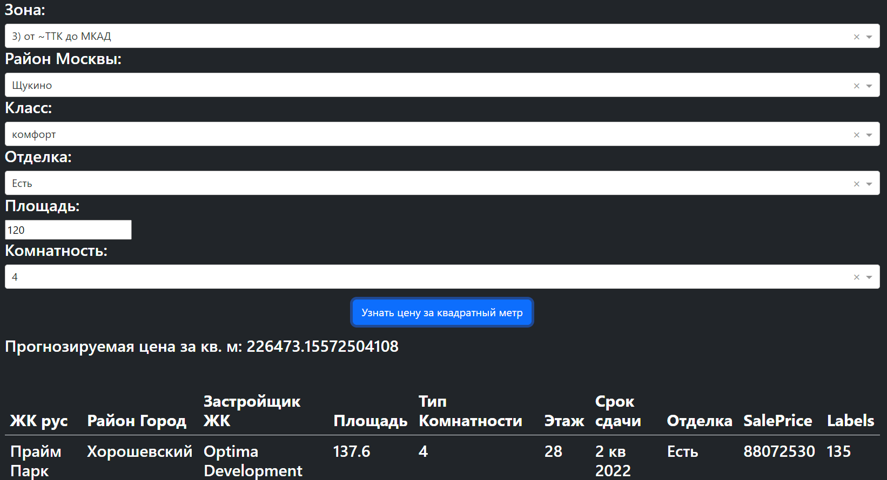

# Pet-project-1
___
Prediction of prices for new buildings in Moscow
XGBoost, CatBoost, DBSCAN, seaborn, pandas, numpy, Dash
___
Финальный результат:
* Точность предсказания в 10% по метрики RMSE и 6% по метрики MSE
* Выбор параметров
* 10 наиболее похожих квартир

Процесс работы над проектом
1) Обработка данных
* Избавление от неинформативных данных
* Работа с выбросами 
* Избавление от отсутствующих данных 
2) Перевод категориальных данных в численные 
* Выбран LabelEncoder в связи с тем, что OnoHotEncoder увеличивал размер таблицы до 400+ колонок 
3) Тренеровка моделей
* Обучаются несколько разных моделей и выбирается лучшая
4) Кластеризация данных с помощью DBSCAN 
5) Обучение классификатора данных
6) Написание web-интерфейса
